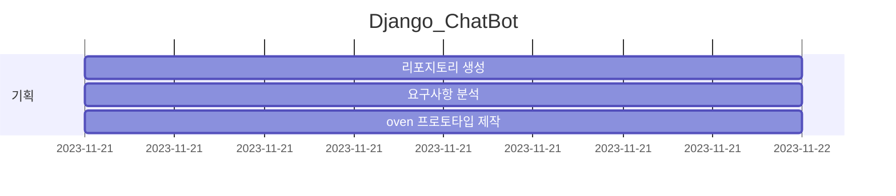
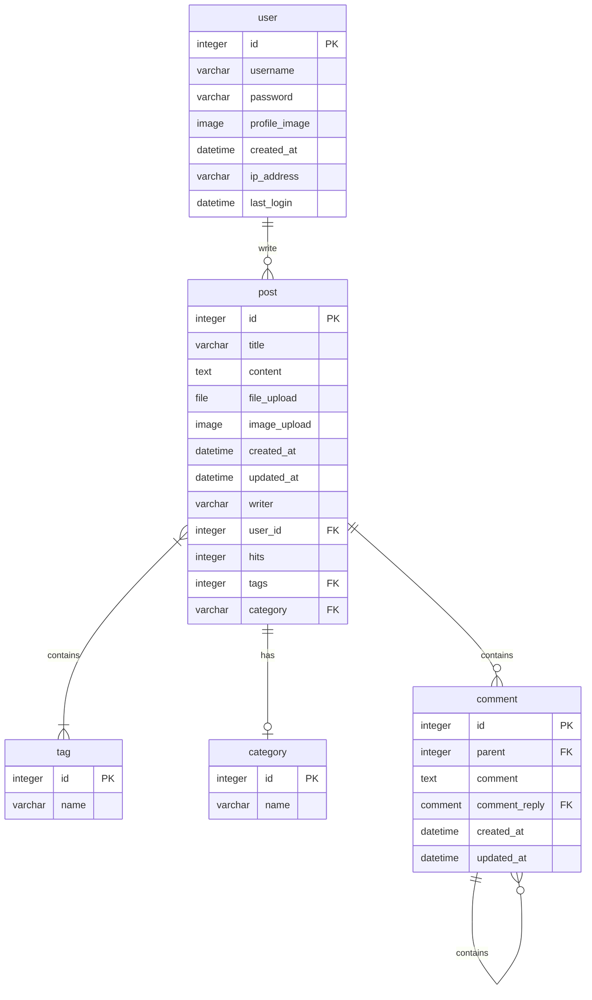
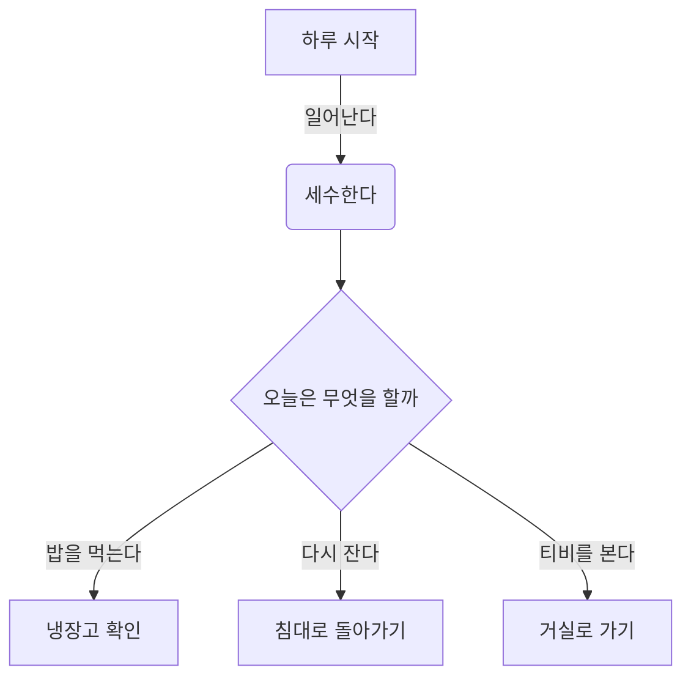
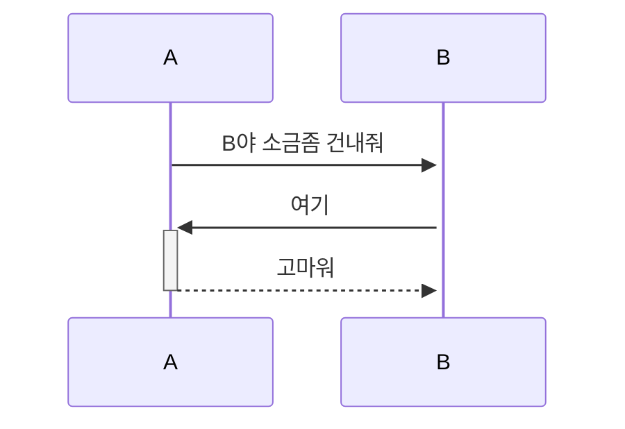
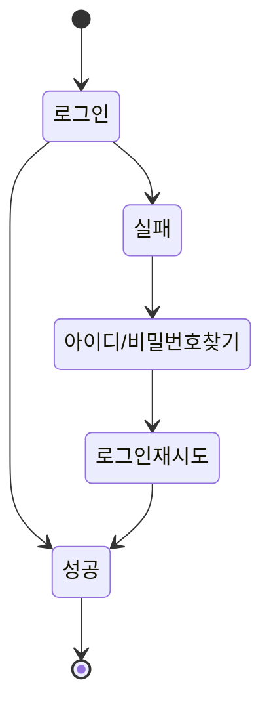

# Django_ChatBot

오르미 미니프로젝트2 - chatGPT를 활용한 채팅 서비스 

## 1. 목표와 기능

### 1.1 목표

### 1.2 기능

### 1.3 팀 구성
- 실제 사진을 업로드 하시길 권합니다.
<table>
	<tr>
		<th>고동우</th>
	</tr>
 	<tr>
		<td></td>
	</tr>
</table>

## 2. 개발 환경 및 배포 URL
### 2.1 개발 환경
- Web Framework
  - Django 3.x (Python 3.8)
- 서비스 배포 환경
  - Amazon Lightsail
...중략...
### 2.2 배포 URL
-

### 2.3 URL 구조
- main

| App       | URL                                        | Views Function    | HTML File Name                        | Note           |
|-----------|--------------------------------------------|-------------------|---------------------------------------|----------------|
| main      | '/'                                        | home              | main/home.html                        | 홈화면          |
| main      | '/about/'                                  | about             | main/about.html                       | 소개화면               |

## 3. 요구사항 명세와 기능 명세
- https://www.mindmeister.com/ 사용하기
- 요구사항 이미지, 마인드맵

## 4. 프로젝트 구조와 개발 일정
### 4.1 프로젝트 구조
📦tutorial  
 ┣ 📂accounts  
 ┃ ┣ 📂migrations  
 ┃ ┣ 📂__pycache__  
 ┃ ┣ 📜admin.py  
 ┃ ┣ 📜apps.py  
 ┃ ┣ 📜forms.py  
 ┃ ┣ 📜models.py  
 ┃ ┣ 📜tests.py  
 ┃ ┣ 📜urls.py  
 ┃ ┣ 📜views.py  
 ┃ ┗ 📜__init__.py  

### 4.1 개발 일정(WBS)
* 작성중,,,

## 5. 역할 분담
- FE/BE : 고동우

## 6. 와이어프레임 / UI / BM

### 6.1 와이어프레임
- 아래 페이지별 상세 설명, 더 큰 이미지로 하나하나씩 설명 필요
https://ovenapp.io/view/qLV1Sb2auwmPikx0rBvP7I9le9V22ByD/

### 6.2 화면 설계
- 화면은 gif파일로 업로드해주세요.
 
<table>
    <tbody>
        <tr>
            <td>메인</td>
            <td>로그인</td>
        </tr>
        <tr>
            <td>
		
            </td>
            <td>
                
            </td>
        </tr>
        <tr>
            <td>회원가입</td>
            <td>정보수정</td>
        </tr>
        <tr>
            <td>
                
            </td>
            <td>
                
            </td>
        </tr>
        <tr>
            <td>검색</td>
            <td>번역</td>
        </tr>
        <tr>
            <td>
                
            </td>
            <td>
                
            </td>
        </tr>
        <tr>
            <td>선택삭제</td>
            <td>글쓰기</td>
        </tr>
        <tr>
            <td>
	        
            </td>
            <td>
                
            </td>
        </tr>
        <tr>
            <td>글 상세보기</td>
            <td>댓글</td>
        </tr>
        <tr>
            <td>
                
            </td>
            <td>
                
            </td>
        </tr>
    </tbody>
</table>

## 7. 데이터베이스 모델링(ERD)

* 아래 ERD는 머메이드를 사용했습니다.

* 아래 ERD는 [ERDCloud](https://www.erdcloud.com/)를 사용했습니다.

* https://dbdiagram.io/home도 많이 사용합니다.

## 8. Architecture

* 아래  Architecture 설계도는 PPT를 사용했습니다.
  

- PPT로 간단하게 작성하였으나, 아키텍쳐가 커지거나, 상세한 내용이 필요할 경우 [AWS architecture Tool](https://online.visual-paradigm.com/ko/diagrams/features/aws-architecture-diagram-tool/)을 사용하기도 합니다.

## 9. 메인 기능

## 10. 에러와 에러 해결
