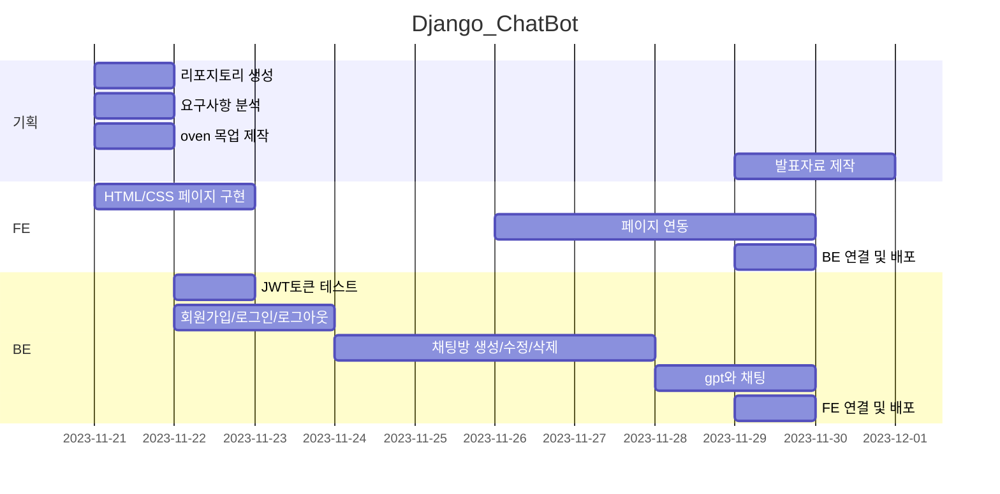

# Django_ChatBot

오르미 미니프로젝트2 - chatGPT활용 채팅 서비스 

## 1. 목표와 기능

### 1.1 목표
- Django DRF를 이용하여 서버를 구현하기
- 마이크로서비스 아키텍처로 개발하기
- OpenAI의 GPT-3.5 모델을 이용하여 서버에서 응답을 처리해서 전달하기
- [ChatGPT영어 상황극 채팅 서비스 만들기 - 이진석 강사님](https://www.inflearn.com/course/chatgpt-%EC%98%81%EC%96%B4-%EC%B1%84%ED%8C%85%EC%84%9C%EB%B9%84%EC%8A%A4-%ED%8C%8C%EC%9D%B4%EC%8D%AC-%EC%9E%A5%EA%B3%A0?inst=4f76c676&utm_source=instructor&utm_medium=referral&utm_campaign=inflearn_%ED%8A%B8%EB%9E%98%ED%94%BD_promotion-link)- 유사한 서비스로 구현

### 1.2 기능
- 사이트 회원가입/로그인/로그아웃 기능
- 채팅방 생성하기
	- 채팅방은 사용언어(한국어, 영어, 일본어), 상황, 역할을 정해서 생성
 	- 채팅방은 수정 가능
  	- 생성한 채팅방은 삭제 가능 	 
- 챗봇과 채팅하기
	- 생성한 채팅방은 로그인한 유저가 본인의 채팅방만 조회 가능
 	- 채팅방에 입장 후, 텍스트 입력 시 GPT의 답변이 전달되고 채팅방에 메세지로 표기 	

### 1.3 팀 구성
<table>
	<tr>
		<th>고동우</th><th>서비스 설계 및 개발</th>
	</tr>
</table>

## 2. 개발 환경 및 배포 URL
### 2.1 개발 환경
- Web Framework
  - Django 4.0.3 (Python 3.11.6)
- 서비스 배포 환경
  - BackEnd: Amazon Lightsail 
  - FrontEnd: Amazon Lightsail 
### 2.2 배포 URL
- http://15.164.74.72/

### 2.3 URL 구조
- accounts

| App       | URL                                        | Views Function    | HTML File Name      | 요청            | Note           |
|-----------|--------------------------------------------|-------------------|---------------------|----------------|----------------|
| accounts      | 'account/signup/'                              | signUpView        | register.html       |Post            | 회원가입       |
| accounts      | 'account/auth/'                                | UserAuthAPIView   | login.html          |Post            | 로그인         |
| accounts      | 'account/auth/'                                | UserAuthAPIView   | -          |Get             | 유저확인       |
| accounts      | 'account/auth/'                                | UserAuthAPIView   | -          |Delete          | 로그아웃       |

- chat
  
| App       | URL                                        | Views Function    | HTML File Name      | 요청            | Note           |
|-----------|--------------------------------------------|-------------------|---------------------|----------------|----------------|
| chat      | 'chat/'                                | RolePlayingRoomAPIView         | chat_list.html  | Get     | 채팅방 조회    |
| chat      | 'chat/create/'                         | CreateRolePlayingRoomAPIView   | create_chat.html | Post   | 채팅방 생성    |
| chat      | 'chat/<int:pk>/'                       | DetailRolePlayingRoomAPIView   | chat_activate.html   | Get | 채팅방 입장    |
| chat      | 'chat/<int:pk>/activate/'              | chatGPT                        | chat_activate.html  | Post | GPT 메세지 요청 |
| chat      | 'chat/<int:pk>/update/'                | UpdateRolePlayingRoomAPIView   | update_chat.html  | Post   | 채팅방 수정    |
| chat      | 'chat/<int:pk>/delete/'                | DeleteRolePlayingRoomAPIView   | chat_list.html  | Delete   | 채팅방 삭제    |

## 3. 요구사항 명세와 기능 명세
- https://www.mindmeister.com/ 사용하기
- 요구사항 이미지, 마인드맵

## 4. 프로젝트 구조와 개발 일정
### 4.1 프로젝트 구조

### 4.1 개발 일정(WBS)

## 5. 역할 분담
- FE/BE : 고동우

## 6. 와이어프레임 / UI / BM

### 6.1 와이어프레임

https://ovenapp.io/view/qLV1Sb2auwmPikx0rBvP7I9le9V22ByD/

### 6.2 화면 설계
- 화면은 gif파일로 업로드해주세요.
 
<table>
    <tbody>
        <tr>
            <td>메인</td>
            <td>로그인</td>
        </tr>
        <tr>
            <td>
		
            </td>
            <td>
                
            </td>
        </tr>
        <tr>
            <td>회원가입</td>
            <td>정보수정</td>
        </tr>
        <tr>
            <td>
                
            </td>
            <td>
                
            </td>
        </tr>
        <tr>
            <td>검색</td>
            <td>번역</td>
        </tr>
        <tr>
            <td>
                
            </td>
            <td>
                
            </td>
        </tr>
        <tr>
            <td>선택삭제</td>
            <td>글쓰기</td>
        </tr>
        <tr>
            <td>
	        
            </td>
            <td>
                
            </td>
        </tr>
        <tr>
            <td>글 상세보기</td>
            <td>댓글</td>
        </tr>
        <tr>
            <td>
                
            </td>
            <td>
                
            </td>
        </tr>
    </tbody>
</table>

## 7. 데이터베이스 모델링(ERD)

## 8. Architecture

## 9. 메인 기능

## 10. 에러와 에러 해결
