# Django_ChatBot


오르미 미니프로젝트2 - chatGPT활용 채팅 서비스 


## 1. 목표와 기능

### 1.1 목표
- Django DRF를 이용하여 서버를 구현하기
- 마이크로서비스 아키텍처로 개발하기
- 로그인/로그아웃을 JWT토큰을 이용해 처리하기
- OpenAI의 GPT-3.5 모델을 이용하여 서버에서 응답을 처리해서 전달하기
- [ChatGPT영어 상황극 채팅 서비스 만들기 - 이진석 강사님](https://www.inflearn.com/course/chatgpt-%EC%98%81%EC%96%B4-%EC%B1%84%ED%8C%85%EC%84%9C%EB%B9%84%EC%8A%A4-%ED%8C%8C%EC%9D%B4%EC%8D%AC-%EC%9E%A5%EA%B3%A0?inst=4f76c676&utm_source=instructor&utm_medium=referral&utm_campaign=inflearn_%ED%8A%B8%EB%9E%98%ED%94%BD_promotion-link)- 유사한 서비스로 구현


### 1.2 기능
- 사이트 회원가입/로그인/로그아웃 기능
- 채팅방 생성하기
	- 채팅방은 사용언어(한국어, 영어, 일본어), 상황, 역할을 정해서 생성
 	- 채팅방은 수정 가능
  	- 생성한 채팅방은 삭제 가능 	 
- 챗봇과 채팅하기
	- 생성한 채팅방은 로그인한 유저가 본인의 채팅방만 조회 가능
 	- 채팅방에 입장 후, 텍스트 입력 시 GPT의 답변이 전달되고 채팅방에 메세지로 표기 	

### 1.3 팀 구성
<table>
	<tr>
		<th>고동우</th>
	</tr>
</table>

## 2. 개발 환경 및 배포 URL
### 2.1 개발 환경
- Web Framework
  - Django 4.0.3 (Python 3.11.6)
- 서비스 배포 환경
  - BackEnd: Amazon Lightsail 
  - FrontEnd: Amazon Lightsail 
### 2.2 배포 URL
- http://15.164.74.72/

### 2.3 URL 구조
- accounts

| App       | URL                                        | Views Function    | HTML File Name      | 요청            | Note           |
|-----------|--------------------------------------------|-------------------|---------------------|----------------|----------------|
| accounts      | 'account/signup/'                              | signUpView        | register.html       |Post            | 회원가입       |
| accounts      | 'account/auth/'                                | UserAuthAPIView   | login.html          |Post            | 로그인         |
| accounts      | 'account/auth/'                                | UserAuthAPIView   | -          |Get             | 유저확인       |
| accounts      | 'account/auth/'                                | UserAuthAPIView   | -          |Delete          | 로그아웃       |

- chat
  
| App       | URL                                        | Views Function    | HTML File Name      | 요청            | Note           |
|-----------|--------------------------------------------|-------------------|---------------------|----------------|----------------|
| chat      | 'chat/'                                | RolePlayingRoomAPIView         | chat_list.html  | Get     | 채팅방 조회    |
| chat      | 'chat/create/'                         | CreateRolePlayingRoomAPIView   | create_chat.html | Post   | 채팅방 생성    |
| chat      | 'chat/<int:pk>/'                       | DetailRolePlayingRoomAPIView   | chat_activate.html   | Get | 채팅방 입장    |
| chat      | 'chat/<int:pk>/activate/'              | chatGPT                        | chat_activate.html  | Post | GPT 메세지 요청 |
| chat      | 'chat/<int:pk>/update/'                | UpdateRolePlayingRoomAPIView   | update_chat.html  | Post   | 채팅방 수정    |
| chat      | 'chat/<int:pk>/delete/'                | DeleteRolePlayingRoomAPIView   | chat_list.html  | Delete   | 채팅방 삭제    |


## 3. 요구사항 명세와 기능 명세


## 4. 프로젝트 구조와 개발 일정
### 4.1 프로젝트 구조
```
📦project
 ┣ 📂backEnd
 ┃ ┣ 📂accounts
 ┃ ┃ ┣ 📂migrations
 ┃ ┃ ┣ 📜admin.py
 ┃ ┃ ┣ 📜apps.py
 ┃ ┃ ┣ 📜managers.py
 ┃ ┃ ┣ 📜models.py
 ┃ ┃ ┣ 📜serializers.py
 ┃ ┃ ┣ 📜tests.py
 ┃ ┃ ┣ 📜urls.py
 ┃ ┃ ┣ 📜views.py
 ┃ ┃ ┗ 📜__init__.py
 ┃ ┣ 📂chat
 ┃ ┃ ┣ 📂migrations
 ┃ ┃ ┣ 📜admin.py
 ┃ ┃ ┣ 📜apps.py
 ┃ ┃ ┣ 📜forms.py
 ┃ ┃ ┣ 📜models.py
 ┃ ┃ ┣ 📜serializers.py
 ┃ ┃ ┣ 📜tests.py
 ┃ ┃ ┣ 📜urls.py
 ┃ ┃ ┣ 📜views.py
 ┃ ┃ ┗ 📜__init__.py
 ┃ ┣ 📂chatProject
 ┃ ┃ ┣ 📂__pycache__
 ┃ ┃ ┣ 📜asgi.py
 ┃ ┃ ┣ 📜settings.py
 ┃ ┃ ┣ 📜urls.py
 ┃ ┃ ┣ 📜wsgi.py
 ┃ ┃ ┗ 📜__init__.py
 ┃ ┣ 📂venv
 ┃ ┣ 📜.env
 ┃ ┣ 📜db.sqlite3
 ┃ ┣ 📜manage.py
 ┃ ┗ 📜requirements.txt
 ┗ 📂frontEnd
 ┃ ┣ 📂css
 ┃ ┣ 📂img
 ┃ ┣ 📂js
 ┃ ┣ 📜chat_activate.html
 ┃ ┣ 📜chat_list.html
 ┃ ┣ 📜create_chat.html
 ┃ ┣ 📜index.html
 ┃ ┣ 📜login.html
 ┃ ┣ 📜PlayGrounds.html
 ┃ ┣ 📜register.html
 ┃ ┗ 📜update_chat.html
```

### 4.1 개발 일정(WBS)

``` mermaid
gantt
    title Django_ChatBot
    dateFormat YY-MM-DD
    section 기획
        리포지토리 생성 :2023-11-21, 1d
        요구사항 분석 :2023-11-21, 1d
        oven 목업 제작 :2023-11-21, 1d
        발표자료 제작 : 2023-11-29, 2d
    section FE
	HTML/CSS 페이지 구현 :2023-11-21, 2d
	페이지 연동 :2023-11-26, 4d
	BE 연결 및 배포 :2023-11-29, 1d
    section BE
	JWT토큰 테스트 :2023-11-22, 1d
	회원가입/로그인/로그아웃 :2023-11-22, 2d
	채팅방 생성 :2023-11-24, 1d
	채팅방 삭제 :2023-11-26, 1d
	채팅방 수정 :2023-11-25, 2d
	gpt와 채팅 :2023-11-28, 2d
	FE 연결 및 배포 :2023-11-29, 1d
    section 발표자료 제작

```



## 5. 역할 분담
- FE/BE : 고동우

## 6. 와이어프레임 / UI / BM

### 6.1 와이어프레임

https://ovenapp.io/view/qLV1Sb2auwmPikx0rBvP7I9le9V22ByD/

<table>
    <tbody>
        <tr>
            <td>메인</td>
            <td>로그인</td>
        </tr>
        <tr>
            <td>
	
            </td>
            <td>
                
            </td>
        </tr>
        <tr>
            <td>채팅방 생성</td>
            <td>채팅방 목록</td>
        </tr>
        <tr>
            <td>
                
            </td>
            <td>
                
            </td>
        </tr>
        <tr>
            <td>채팅 활성화</td>
        </tr>
        <tr>
            <td>
                
            </td>
        </tr>
    </tbody>
</table>

### 6.2 화면 설계
- 화면은 gif파일로 업로드해주세요.
 
<table>
    <tbody>
        <tr>
            <td>메인</td>
            <td>로그인</td>
        </tr>
        <tr>
            <td>
		
            </td>
            <td>
                
            </td>
        </tr>
        <tr>
            <td>채팅방 생성</td>
            <td>채팅방 조회</td>
        </tr>
        <tr>
            <td>
                
            </td>
            <td>
                
            </td>
        </tr>
        <tr>
            <td>채팅방 삭제</td>
            <td>채팅 활성화</td>
        </tr>
        <tr>
            <td>
                
            </td>
            <td>
                
            </td>
        </tr>
    </tbody>
</table>


## 7. 데이터베이스 모델링(ERD)


## 8. Architecture


## 9. 메인 기능
1. 회원가입 및 로그인
2. 채팅방 생성/조회/수정/삭제
3. 채팅 / 채팅 기록 저장
<table>
    <tbody>
        <tr>
            <td>채팅 </td>
            <td>로그인</td>
        </tr>
        <tr>
            <td>
		
            </td>
            <td>
                
            </td>
        </tr>
    </tbody>
</table>


## 10. 에러와 에러 해결

1. JS array객체인줄 알았는데 아니여서 값을 조회 못했던 점
- Array.from(data) 해결, console.log 출력
2. getElementId가 null 값이 나오는 점 (페이지 로드시, 해당 태그가 없어서)
- 스크립트에 호출하여 해당 태그가 생성되고 난 뒤에 함수를 생성하여 해결
3. 데이터 조회 및 전달 방식
- url에 id값을 넣어 다음 페이지로 이동하고, 해당 페이지에서 요청하여 해결'
4. setting에 필요한 .env파일 


